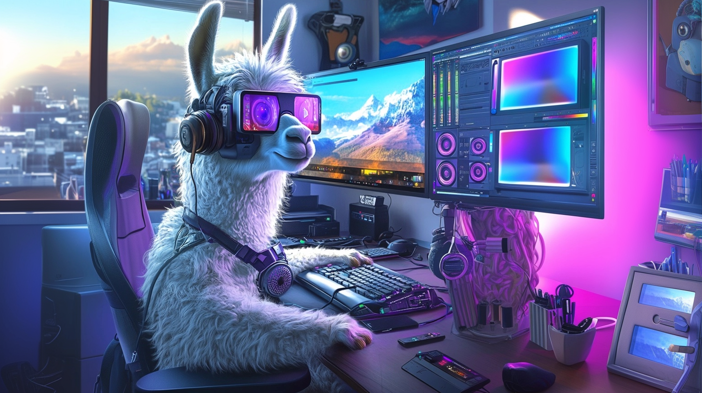
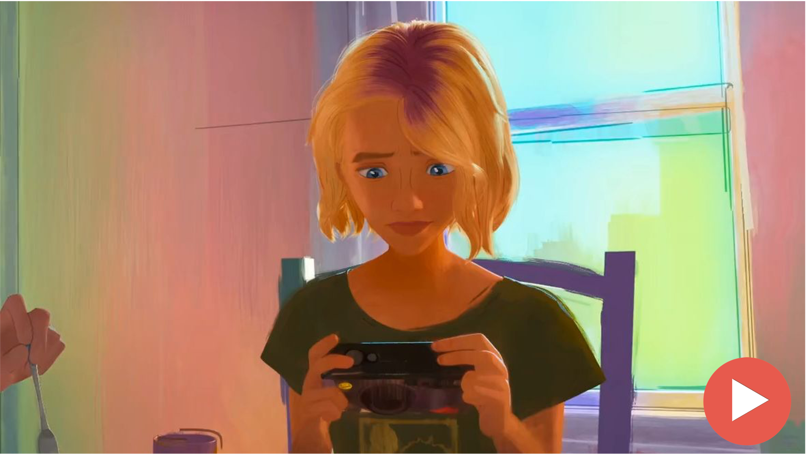
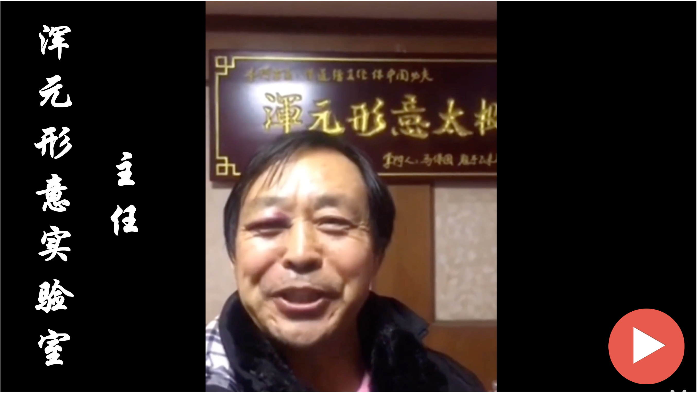
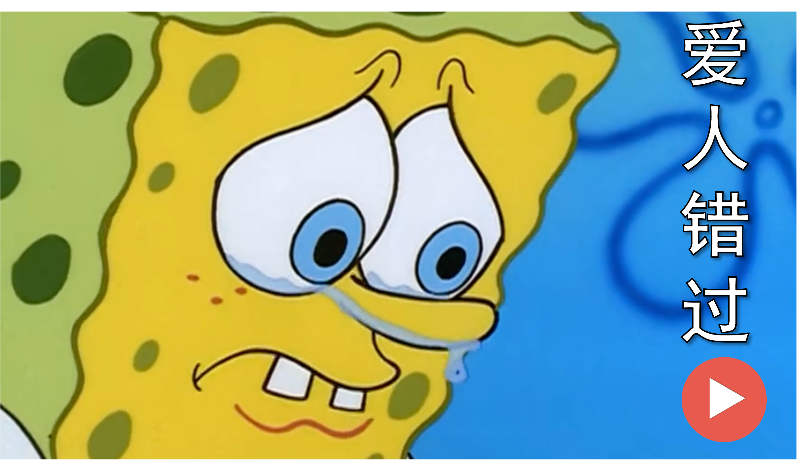
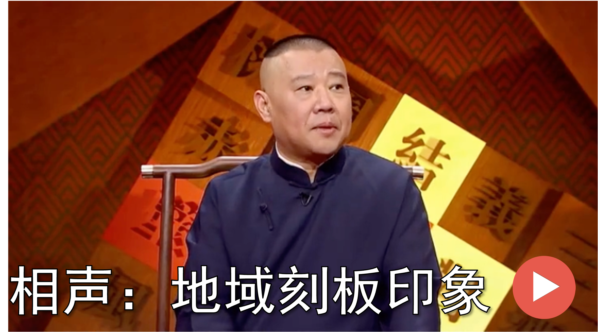
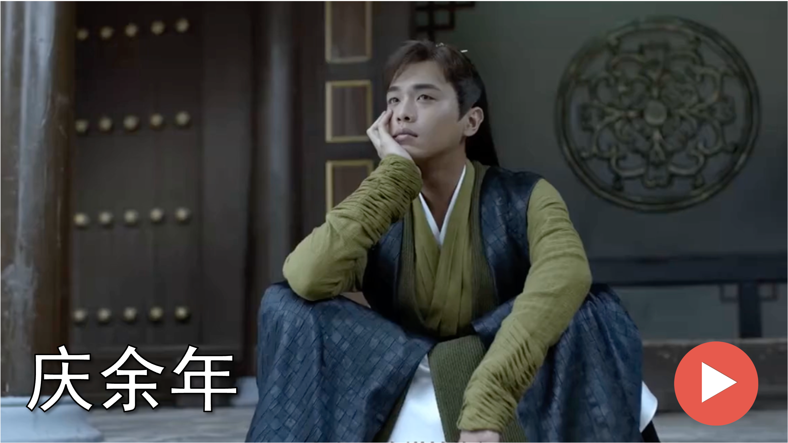
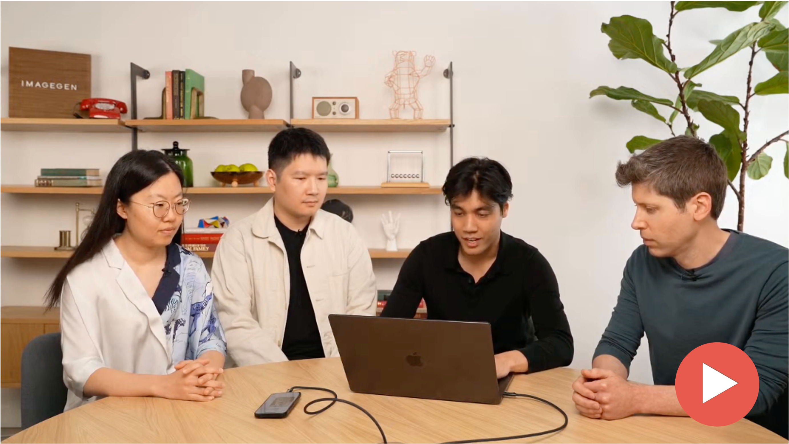

<h1 align='center'>🚀 Agentic-AIGC: Video Production with <br/> Multi-Modal Agents</h1>
<!-- <h1 align='center'>🚀 Agentic-AIGC: Multi-Modal Agents for Video Production</h1> -->

<div align='center'>
    <h3>
    One Prompt → Video Creation: AI Unleashed<br/>
    </h3>
</div>

## 🎯 Introduction

This project serves as a **Comprehensive Cookbook for Agentic-AIGC Development**, with a primary focus on video creation workflows. It guides readers through the emerging field of agent-based AI-generated content creation. Video production represents the ultimate complexity challenge in AIGC.

Creating professional videos requires seamless coordination of script writing, storyboard development, visual scene generation, character animation, audio synthesis, voice acting, background music composition, scene transitions, visual effects, and final editing.

Traditional AIGC approaches rely on single-model generation with limited scope and coordination capabilities. Agentic-AIGC represents the next frontier where intelligent agents orchestrate sophisticated creative ecosystems. These agents coordinate multiple AI tools seamlessly. They make nuanced creative decisions in real-time. Most importantly, they maintain narrative and visual coherence across complex, multi-stage production pipelines.

---

## ✨ What Will You Gain?

### Core Knowledge & Skills
- 📚 **Agentic-AIGC Fundamentals** - Deep understanding of agent-based content generation concepts and architectural patterns
- 🍳 **Hands-On Experience** - Working implementations of complete video production workflows from concept to final output
- 🤖 **Multi-Tool Coordination** - Practical examples of orchestrating different AI models for seamless creative collaboration

### Autonomous Video Creation Agents
- 🎬 **Intelligent Video Production** - Build agents that make independent creative decisions throughout video production pipelines.
- 🎵 **Self-Directed Audio Processing** - Develop agents that autonomously handle voice synthesis, music selection, and audio-visual synchronization.
- 🔧 **Agent Orchestration Patterns** - Master architectures where specialized agents collaborate to manage complex video workflows autonomously.

### Production-Ready Solutions
- 🌐 **Cross-Modal Applications** - Work with text, audio, and visual content simultaneously while maintaining narrative coherence.
- 📖 **Ready-to-Use Recipes** - Six comprehensive video production workflows you can immediately adapt and extend for your projects.

<div align='center'>

</div>

## 🧾 Table of Contents

- [🎯 Project Introduction](#-project-introduction)
  - [✨ What Will You Gain?](#-what-will-you-gain)
- [🧾 Table of Contents](#-table-of-contents)
- [🍳 What is Agentic-AIGC](#-what-is-agentic-aigc)
- [🧾 Prerequisites \& Setup](#-prerequisites--setup)
  - [Environment](#environment)
  - [Clone and Install](#clone-and-install)
  - [Download Required Models](#download-required-models)
  - [Configure LLM](#configure-llm)
- [🍽 Recipes: Creating Videos](#-recipes-creating-videos)
  - [🎬 Movie Edits (Rhythm-Based)](#-movie-edits-rhythm-based)
  - [📖 Novel-to-Screen Adaptation](#-novel-to-screen-adaptation)
  - [📰 News Summary](#-news-summary)
  - [😂 Meme Video](#-meme-video)
  - [🎵 Music Video (SVC)](#-music-video-svc)
  - [🎭 Cross-Culture Comedy](#-cross-culture-comedy)
- [📋 Configuration Details](#-configuration-details)
  - [Input Configuration](#input-configuration)
  - [Character Image for Visual Retrieval Enhancement](#character-image-for-visual-retrieval-enhancement)
  - [Running the Tool](#running-the-tool)
- [🎥 Demos](#-demos)
- [🙏 Acknowledgements](#-acknowledgements)

---

## 🍳 What is Agentic-AIGC

🚀 Recent breakthroughs in generative AI have transformed multimedia content creation across diverse domains. Powered by advanced diffusion models and Large Language Models (LLMs), AI-Generated Content (AIGC) has achieved remarkable success in 🖼️ image generation, 🎵 audio creation, 🎮 interactive media, and 🎭 multimodal experiences.

⚡ While these achievements are impressive, creating truly high-quality, sophisticated multimedia content--particularly 🎬 complex videos--presents challenges that extend far beyond simple generation tasks.

🎯 Success in this domain requires seamless i) 🔄 multi-modal alignment to synchronize visual, audio, and textual elements across temporal sequences; ii) 📖 maintaining narrative coherence and visual continuity throughout extended content; iii) 🎨 orchestrating dynamic scene compositions with complex transitions and character interactions, and iv) ⚙️ coordinating sophisticated production pipelines while ensuring professional quality standards across all components.

❌ These challenges cannot be addressed by generative models alone, as they lack 🎭 orchestration capabilities for complex multi-step creative workflows, and unable to coordinate multiple specialized tools or maintain consistency across interconnected production processes that require 🗺️ deliberate planning and 🔗 cross-modal synchronization.

### 🔧 The Agentic-AIGC Solution

🎯 To directly address these fundamental challenges, **Agentic-AIGC** leverages 🤖 intelligent agent architectures that systematically solve each limitation through 🔄 coordinated automation. Unlike 📱 traditional generative models, the 🧠 agentic approach tackles 🎬 complex video production through ⚡ fully-automated intelligent workflows.

---

## 🧾 Prerequisites & Setup

This section walks you through the environment setup to get Agentic-AIGC running on your device.

### Environment

*   **GPU Memory:** 8GB
*   **System:** Linux, Windows

### Clone and Install

```bash
# 1. Clone the repository
git clone https://github.com/HKUDS/Agentic-AIGC.git

# 2. Create and activate a Conda environment
conda create --name aicreator python=3.10
conda activate aicreator

# 3. Install system dependencies (pynini, ffmpeg)
conda install -y -c conda-forge pynini==2.1.6 ffmpeg

# 4. Install Python dependencies
pip install -r requirements.txt
```

### Download Required Models

Ensure `git-lfs` is installed first: [https://git-lfs.com](https://git-lfs.com)

```bash
git lfs install
```

Navigate to the `tools` directory and download the necessary models. You only need to download the models relevant to the video types you want to create (see feature/model table below).

```bash
# Example downloads (adjust paths and models as needed)

# Download CosyVoice
cd tools/CosyVoice
huggingface-cli download PillowTa1k/CosyVoice --local-dir pretrained_models

# Download fish-speech
cd tools/fish-speech
huggingface-cli download fishaudio/fish-speech-1.5 --local-dir checkpoints/fish-speech-1.5

# Download seed-vc
cd tools/seed-vc
huggingface-cli download PillowTa1k/seed-vc --local-dir checkpoints

# Download DiffSinger
cd tools/DiffSinger
huggingface-cli download PillowTa1k/DiffSinger --local-dir checkpoints

# Download MiniCPM
cd tools
git lfs clone https://huggingface.co/openbmb/MiniCPM-V-2_6-int4  

# Download Whisper
cd tools
git lfs clone https://huggingface.co/openai/whisper-large-v3-turbo  


# Download ImageBind
cd tools
mkdir .checkpoints
cd .checkpoints
wget https://dl.fbaipublicfiles.com/imagebind/imagebind_huge.pth  
```
---

**Feature & Model Requirements Table:**

<div align="center">
<table>
<tr>
<th align="center">Feature</th>
<th align="center">Agentic-AIGC</th>
<th align="center">Director</th>
<th align="center">Funclip</th>
<th align="center">NarratoAI</th>
<th align="center">NotebookLM</th>
</tr>
<tr>
<td align="center">Beat-synced Edits</td>
<td align="center">✅</td>
<td align="center">✅</td>
<td align="center">✅</td>
<td align="center">—</td>
<td align="center">—</td>
</tr>
<tr>
<td align="center">Storytelling Video</td>
<td align="center">✅</td>
<td align="center">—</td>
<td align="center">—</td>
<td align="center">✅</td>
<td align="center">—</td>
</tr>
<tr>
<td align="center">Video Overview</td>
<td align="center">✅</td>
<td align="center">✅</td>
<td align="center">✅</td>
<td align="center">✅</td>
<td align="center">✅</td>
</tr>
<tr>
<td align="center">Meme Video</td>
<td align="center">✅</td>
<td align="center">—</td>
<td align="center">—</td>
<td align="center">—</td>
<td align="center">—</td>
</tr>
<tr>
<td align="center">Music Remixes</td>
<td align="center">✅</td>
<td align="center">—</td>
<td align="center">—</td>
<td align="center">—</td>
<td align="center">—</td>
</tr>
<tr>
<td align="center">Comedy Remaking</td>
<td align="center">✅</td>
<td align="center">—</td>
<td align="center">—</td>
<td align="center">—</td>
<td align="center">—</td>
</tr>
</table>
</div>


<div align="center">

<table>
  <tr>
    <th align="center">Feature Type</th>
    <th align="center">Video Demo</th>
    <th align="center">Required Models</th>
  </tr>
  <tr>
    <td align="center">Cross Talk</td>
    <td align="center">English Stand-up Comedy to Chinese Crosstalk</td>
    <td align="center">CosyVoice, MiniCPM, Whisper, ImageBind</td>
  </tr>
  <tr>
    <td align="center">Talk Show</td>
    <td align="center">Chinese Crosstalk to English Stand-up Comedy</td>
    <td align="center">CosyVoice, MiniCPM, Whisper, ImageBind</td>
  </tr>
  <tr>
    <td align="center">MAD TTS</td>
    <td align="center">Xiao-Ming-Jian-Mo(小明剑魔) Meme</td>
    <td align="center">fish-speech</td>
  </tr>
  <tr>
    <td align="center">MAD SVC</td>
    <td align="center">AI Music Videos</td>
    <td align="center">DiffSinger, seed-vc, MiniCPM, Whisper, ImageBind</td>
  </tr>
  <tr>
    <td align="center">Rhythm</td>
    <td align="center">Spider-Man: Across the Spider-Verse</td>
    <td align="center">MiniCPM, Whisper, ImageBind</td>
  </tr>
  <tr>
    <td align="center">Comm</td>
    <td align="center">Novel-to-Screen Adaptation</td>  
    <td align="center">MiniCPM, Whisper, ImageBind</td>
  </tr>
  <tr>
    <td align="center">News</td>
    <td align="center">Tech News: OpenAI's GPT-4o Image Generation Release</td>
    <td align="center">MiniCPM, Whisper, ImageBind</td>
  </tr>
</table>

</div>

### Configure LLM

1.  **API Keys:** Edit `Agentic-AIGC/environment/config/config.yml` to add your LLM API key and base URL.
2.  **Model Names:** Check and adjust model names in `environment/config/llm.py` according to your LLM provider's requirements. For single-model APIs like official GPT, use the specific model name (e.g., `gpt-4o-mini`) for all entries.
  
---

## 🍽 Agentic Video Creation: Step-by-Step Recipes

📋 Each production recipe below represents a distinct video format that can be automatically generated through Agentic-AIGC's intelligent agent system.

---

### ✂️ Video Editing

**Goal:** Create a video edit synchronized with music beats or based on a user's narrative idea, selecting high-energy or relevant clips from source videos.

**Key Steps:**

- 📁 1. **Prepare Source Material**: Place your source video clips in a directory (e.g., dataset/user_video/).
- 🎵 2. **Prepare Music (Optional for beat-sync)**: Place your background music file (e.g., .mp3) in your project.
- ▶️ 3. **Run the Tool**: Execute python main.py.
- 🎯 4. **Select Type**: When prompted, input type eg. Rhythm-Based Video Editing.
- 💬 5. **Provide Prompt**: Enter a detailed description of the editing style/feel you want (e.g., "Fast-paced action sequences with dynamic transitions...").
- ⚙️ 6. **(Optional) Adjust Beat Sync**: Modify parameters in music_filter.py (thresholds, masks) if needed.
- 🎬 7. **Processing & Output**: The system will process, analyze videos, detect beats, retrieve visually relevant clips, and generate the final edited video.

---

### 📖 Text-to-Video Adaptation

**Goal:** Transform written text (such as novel excerpts) into cinematic video content with AI-generated commentary and visually matched scenes from your source footage.

**Key Steps:**

- 📁 1. **Prepare Source Material**: Place your source video clips in a directory (e.g., dataset/user_video/). Add your novel .txt file to the project.
- 🎤 2. **(Optional) Prepare Voice Sample**: Place a short .wav file (e.g., ava_16k.wav) for voice cloning in dataset/video_edit/voice_data/.
- ✍️ 3. **(Optional) Prepare Style File**: Customize or input dataset/video_edit/writing_data/present_style.txt file describing the desired commentary tone.
- ▶️ 4. **Run the Tool**: Execute python main.py.
- 🎯 5. **Select Type**: When prompted, input type eg. Novel-to-Screen Commentary.
- 💬 6. **Provide Prompt**: Enter a prompt for the commentary script (e.g., "Generate an engaging commentary script with 1500 words.").
- 🎬 7. **Processing & Output**: The system will generate the script, segment the content, synthesize audio narration, match visual scenes, and produce the final adapted video.

---

### 📰 Video Summarization

**Goal:** Generate concise summary videos from lengthy source content. Supports interviews, lectures, meetings, news videos, podcasts, webinars, documentaries, and various video/audio materials.

**Key Steps:**

- 📁 1. **Prepare Source Material**: Place your source video/audio file in a directory (e.g., dataset/user_video/).
- 🎤 2。 **Prepare Voice Sample (Optional)**: Add a short .wav file (e.g., ava_16k.wav) for voice cloning in dataset/video_edit/voice_data/.
- ✍️ 3. **Prepare Style File (Optional)**: Customize dataset/video_edit/writing_data/present_style.txt to define the summary tone and style.
- ▶️ 4. **Run the Tool**: Execute python main.py to start the process.
- 🎯 5. **Select Type**: When prompted, input the type (e.g., Summary of News).
- 💬 6. **Provide Prompt**: Enter specifications for your summary (e.g., "Create a concise tech news summary with conversational tone, maximum 250 words").
- 🎬 7. **Processing Complete**: The system will automatically transcribe content, generate summary, synthesize voiceover, match relevant clips, and produce the final video.

---

### 😂 Audio Editing

**Goal:** Replace existing video audio with custom scripts or narratives. Maintains precise video-audio synchronization for professional dubbing and creative content adaptation.

**Key Steps:**

- 📁 1. **Prepare Source Video**: Place your source video file (e.g., .mp4) in a directory (e.g., dataset/meme_video/).
- ⚙️ 2. **Configure Settings**: Edit Agentic-AIGC/environment/config/mad_tts.yml. Set video_path to your source video and adjust output_path if needed.
- ▶️ 3. **Run the Tool**: Execute python main.py to start the audio editing process.
- 🎯 4. **Select Type**: When prompted, choose TTS (Text-to-Speech) for audio generation.
- ✍️ 5. **Provide Script**: Enter detailed instructions for the new audio content (e.g., "Create a professional narration explaining machine learning concepts with clear pronunciation and appropriate pacing").
- 🎵 6. **Processing Complete**: The system will extract original audio, transcribe existing content, generate new audio using Fish-Speech technology, synchronize timing with video frames, and produce the final edited video.

### 🎵 AI Cover Creation

**Goal:** Generate professional cover versions of songs using custom target voices. Includes precise audio-visual synchronization capabilities.

**Key Steps:**

- 1. 📂 **Prepare Files**: Place MIDI file, lyrics (.txt), background music (BGM), and target voice sample (.wav) in the project directory.
- 2. ⚙️ **Configure Settings**: Edit Agentic-AIGC/environment/config/mad_svc.yml. Set paths for midi_path, lyrics_path, bgm_path, and target_voice_path.
- 3. ▶️ **Run Tool**: Execute python main.py.
- 4. 🎯 **Select Mode**: Choose SVC (Singing Voice Conversion) when prompted.
- 5. ✍️ **Provide Instructions**: Enter adaptation prompt (e.g., "Rock ballad style with emotional intensity, focusing on perseverance themes").
- 6. 🎶 **Processing**: System processes MIDI, generates audio (DiffSinger), clones voice (Seed-VC), synchronizes timing, and integrates with video pipeline.

### 🎭 Cross-Cultural Content Adaptation

**Goal:** Adapt audio content (e.g., English talk shows) into different cultural formats (e.g., Chinese crosstalk), or vice versa.

**Key Steps:**

- 1. 📂 **Prepare Source Audio**: Place source audio file (.wav) in the directory (e.g., dataset/cross_talk/).
- 2. 🎤 **Prepare Voice Samples**: Add target voice .wav files (e.g., Guo Degang, Fu Hang - ready-to-use samples available in repository).
- 3. ⚙️ **Configure Settings**: Edit Agentic-AIGC/environment/config/cross_talk.yml (or talk_show.yml). Set audio_path to source audio. Configure dou_gen, peng_gen voice paths. Adjust output path.
- 4. ▶️ **Run Tool**: Execute python main.py.
- 5. 🎯 **Select Mode**: Choose Cross Talk or Talk Show when prompted.
- 6. ✍️ **Provide Instructions**: Enter content adaptation prompt (e.g., "Adapt this content into Chinese crosstalk format while maintaining the original humor style").
- 7. 🎭 **Processing**: System adapts script content, synthesizes target voices using CosyVoice, adds audio effects, and integrates with video editing pipeline.

---

## 📋 Configuration Details

### Input Configuration

Input settings for different video types are managed in YAML files located in `Agentic-AIGC/environment/config/`. Common parameters include:

*   `reqs`: A prompt or instruction for the specific agent.
*   `audio_path`: Path to the source audio file.
*   `video_source_dir`: Path to the directory containing source video clips.
*   `novel_path`: Path to the source text file (for novel adaptation).
*   `output`: Path for the final generated video file.
*   `dou_gen`, `peng_gen`, etc.: Paths to specific voice sample files for cloning.

Always ensure paths in these YAML files are correct relative to your project structure.

### Running the Tool

After setup and configuration:

1.  Activate your Conda environment: `conda activate aicreator`.
2.  Run the main script from the project root: `python main.py`.
3.  Follow the on-terminal prompts to select the video type and provide any required input.

## 🎥 Demos

<table>
<tr>
<td align="center" width="33%">
<a href="https://www.bilibili.com/video/BV1C9Z6Y3ESo/" target='_blank'></a>
Movie Edits
</td>
<td align="center" width="33%">
<a href="https://www.bilibili.com/video/BV1ucZ6YmEBU/" target='_blank'></a>
Meme Videos
</td>
<td align="center" width="33%">
<a href="https://www.bilibili.com/video/BV1t8ZCYsEeA/" target='_blank'></a>
Music Videos
</td>
</tr>
<tr>
<td align="center" width="33%">
<a href="https://www.bilibili.com/video/BV1ucZ6YmESg/" target='_blank'></a>
Verbal Comedy Arts
</td>
<td align="center" width="33%">
<a href="https://www.bilibili.com/video/BV1TmZ6YjEvV/" target='_blank'></a>
Commentary Video
</td>
<td align="center" width="33%">
<a href="https://www.bilibili.com/video/BV12mZ6YLEqW/" target='_blank'></a>
Video Overview
</td>
</tr>
</table>

For additional demo usage details, please refer to:  
👉 [Demos Documentation](demos_documents.md)


You can find more fun videos on our Bilibili channel here:  
👉 [Bilibili Homepage](https://space.bilibili.com/3546868449544308)  
Feel free to check it out for more entertaining content! 😊

**Note**: All videos are used for research and demonstration purposes only. The audio and visual assets are sourced from the Internet. Please contact us if you believe any content infringes upon your intellectual property rights.

---

## 🙏 Acknowledgements

We extend our heartfelt appreciation to the countless individuals and organizations who have made Agentic-AIGC possible. This project builds upon the foundation laid by pioneering AI researchers and the vibrant open-source community worldwide. Their collective contributions, shared knowledge, and innovative breakthroughs have been instrumental in bringing this vision to life.

We are deeply grateful to the open-source community and AI service providers whose innovative tools and technologies serve as the cornerstone of our work:

- [CosyVoice](https://github.com/FunAudioLLM/CosyVoice  )
- [Fish Speech](https://github.com/fishaudio/fish-speech  )
- [Seed-VC](https://github.com/Plachtaa/seed-vc  )
- [DiffSinger](https://github.com/MoonInTheRiver/DiffSinger  )
- [VideoRAG](https://github.com/HKUDS/VideoRAG  )
- [ImageBind](https://github.com/facebookresearch/ImageBind  )
- [whisper](https://github.com/openai/whisper  )
- [MiniCPM](https://github.com/OpenBMB/MiniCPM-o  )
- [Librosa](https://github.com/librosa/librosa  )
- [moviepy](https://github.com/Zulko/moviepy  )
- [ffmpeg](https://github.com/FFmpeg/FFmpeg  )

Our work has been significantly enhanced by the creative contributions of talented content creators across diverse platforms:
- 🎬 Original video creators whose content served as valuable testing and demonstration material
- 🎭 Comedy artists whose performances inspired our cross-cultural adaptation features
- 🎥 Filmmakers and production teams behind the movies and TV shows showcased in our demonstrations
- ✂️ Content creators who generously shared their expertise and insights on video editing techniques

All content used in our demonstrations is for research purposes only. We deeply respect the intellectual property rights of all content creators and welcome any concerns or feedback regarding content usage.
- Spider-Man movie editing idea reference Douyin account[@我是不是zx](https://www.douyin.com/user/MS4wLjABAAAApVuuGxyM7CI4MJRHQvc6SAy0J2zrJ12eg3f5jFqCIXk?from_tab_name=main&vid=7468621366913273115)

<!-- # Framework of Agentic-AIGC

[First a framework plot]
Then a short explanation on the framework, without specific technical details. -->
